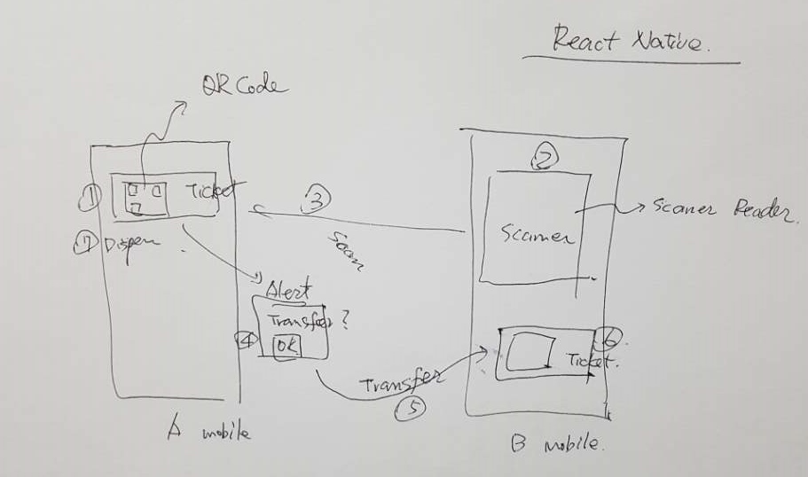

# Ticket Clerk

## About
  
### Transfer a Ticket via QR Code

  

### Flow

Order|Where|Action
:-:|:-:|:-:
1 | A | Open QR code for the ticket
2 | B | Open Scanner 
3 | B | Scan QR code
4 | A | Appear Alert to confirm to transfer
5 | - | transfer to B
6 | B | Appear the ticket from A
7 | B | Disappear the ticket
  
  

## Stack
- Expo
- React-native
- React-navigation
  

  
## Demo
You need to use Expo service to run this demo application.
1. Sign in Expo serive [Expo](https://expo.io)
2. Install Expo App in your phone
3. Open Expo App
4. Open demo App via QR code on below address

> [Android Apk Link](https://expo.io/builds/2231d095-fe41-43ef-91bd-134fb2c1e70d)